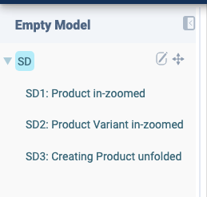
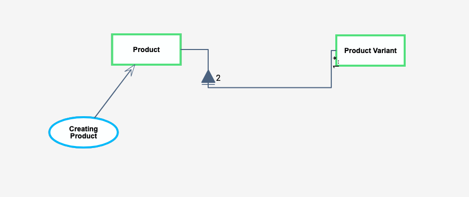
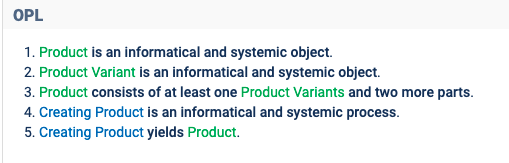
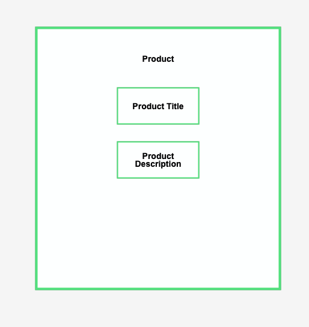
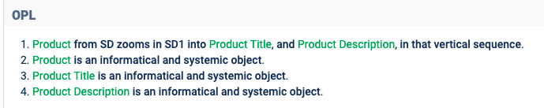
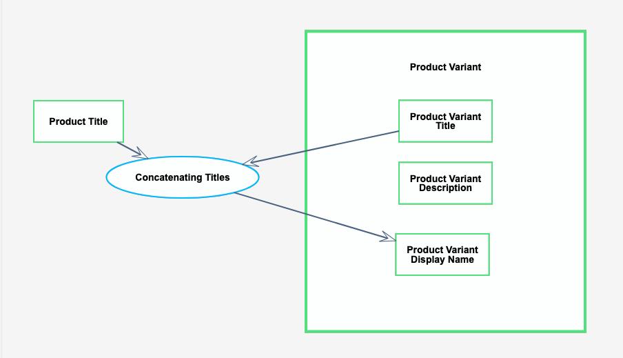
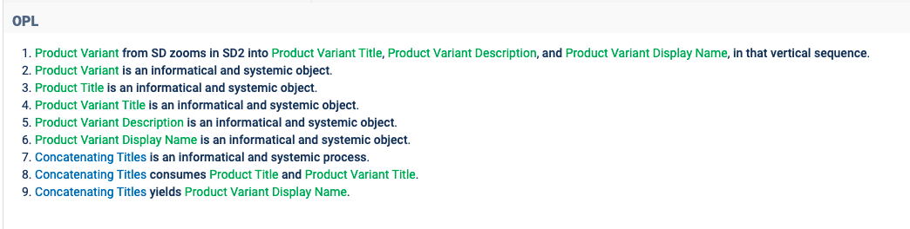
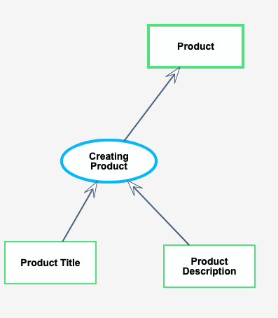
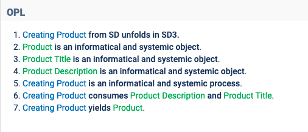

# ProductCRUD in OPM

## SD

- `Product` is an informational and systemic object.
- `Product Variant` is an informational and systemic object.
- `Product` consists of at least one `Product Variants` and two more parts.
- `Creating Product` is an informational and systemic process.
- `Creating Product` yields `Product`.

## SD1: Product in-zoomed

- `Product` from SD zooms in SD1 into `Product Title`, and `Product Description`, in that vertical sequence.
- `Product` is an informational and systemic object.
- `Product Title` is an informational and systemic object.
- `Product Description` is an informational and systemic object.

## SD2: Product Variant in-zoomed

- `Product Variant` from SD zooms in SD2 into `Product Variant Title`, `Product Variant Description`, and `Product Variant Display Name`, in that vertical sequence.
- `Product Variant` is an informational and systemic object.
- `Product Title` is an informational and systemic object.
- `Product Variant Title` is an informational and systemic object.
- `Product Variant Description` is an informational and systemic object.
- `Product Variant Display Name` is an informational and systemic object.
- `Concatenating Titles` is an informational and systemic process.
- `Concatenating Titles` consumes Product Title and Product Variant Title.
- `Concatenating Titles` yields Product Variant Display Name.

## SD3: Creating Product unfolded

- `Creating Product` from SD unfolds in SD3.
- `Product` is an informational and systemic object.
- `Product Title` is an informational and systemic object.
- `Product Description` is an informational and systemic object.
- `Creating Product` is an informational and systemic process.
- `Creating Product` consumes Product Description and Product Title.
- `Creating Product` yields Product.